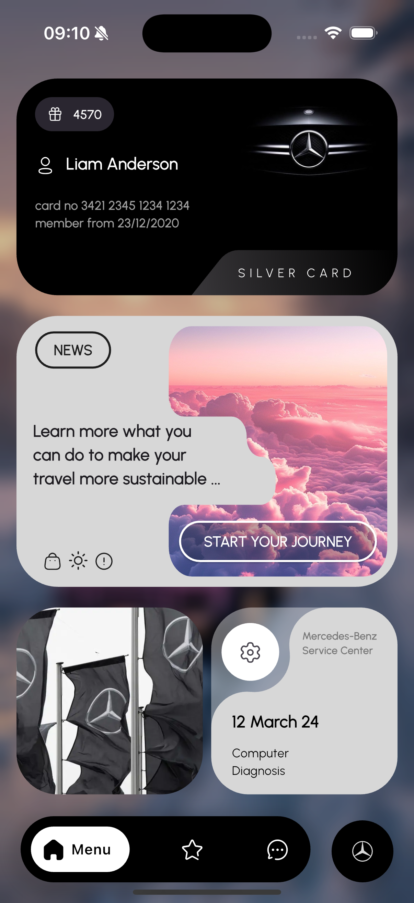

# 🚗 Mythic Benz - Flutter App

📌 **Overview**  
Mythic Benz is a clean and modern Flutter application inspired by a concept car design seen on Instagram. This project highlights best practices in routing, screen composition, and code organization. It includes authentication and dashboard flows with beautiful transitions and a modular widget architecture.

🖼️ **Screenshot**  


🎯 **Features**  
🔐 Clean Authentication Flow with separation of concerns  
🧭 Advanced Routing with animated transitions  
🏠 Dashboard with Home Tab and smooth UI animations  
🧱 Decomposed UI using reusable widgets  
🧩 Context Extensions for cleaner code and less boilerplate  
🎨 Centralized constants for assets, colors, and text styles

🚀 **Getting Started**

**Prerequisites**  
Ensure you have the following installed:

- Flutter SDK
- Dart SDK (included with Flutter)
- Android Studio or VS Code (with Flutter plugin)
- A physical device or emulator

**Installation**

Clone the repository:
```bash
git clone https://github.com/Radhwen1999/mythic_benz.git
cd mythic_benz
```

Install dependencies:
```bash
flutter pub get
```

Run the app:
```bash
flutter run
```

📂 **Project Structure**
```
📦 mythic_benz
├── lib
│   ├── main.dart                      # App entry point
│   ├── core/                          # Common utils, extensions, constants
│   ├── features/
│   │   ├── auth/                      # Auth feature (sign in screen, logic)
│   │   ├── dashboard/                 # Dashboard and home tab
│   ├── shared/                        # Shared widgets and components
├── assets/
│   ├── images/                        # Image assets
│   ├── icons/                         # SVG and icons
├── android/                           # Android-specific config
├── ios/                               # iOS-specific config
├── pubspec.yaml                       # Dependencies and metadata
├── README.md                          # Project documentation
```

💡 **Contribution**  
Contributions are welcome! Feel free to fork the project and submit pull requests.

💻 Built with Flutter & ❤️ by Radhwen Rmili
